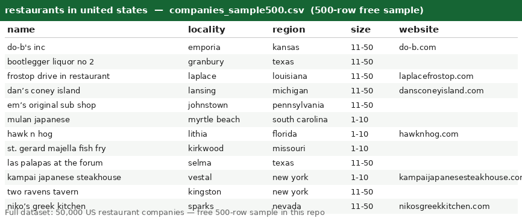

# Restaurants in United States — US Restaurant Company Dataset (50,000 Records)

## 📥 Get the data

| File | Rows | Format | Link |
|---|---|---|---|
| **Free sample** | 500 rows | CSV | [companies_sample500.csv](companies_sample500.csv) |
| **Full dataset** | **50,000 rows** | CSV | 👉 **Buy on Gumroad — $2 per 10,000 records ($10 total)** → **https://islandprosoftware.gumroad.com/l/suhxvk** |

> ⭐ **Start with the [free 500-row sample](companies_sample500.csv)** — same columns, same format as the full file. If it fits your workflow, grab the complete 50,000-row dataset on Gumroad.

---

## What's in this repo

This repo contains a **free 500-row sample** of US restaurant companies, extracted from a 32.3-million-row open company dataset. The sample lets you inspect the schema and data quality before buying the full file.

- **`companies_sample500.csv`** — 500 real records, free, no strings attached ([download](companies_sample500.csv))
- **`preview.png`** — screenshot of the sample opened in a spreadsheet (above)
- **Full dataset (`companies.csv`, 50,000 rows)** — available on Gumroad (link above), *not* included here to keep this repo light

All 50,000 records match `country = 'united states'` AND `industry = 'restaurants'`, taken first-N in source file order (no cherry-picking).

## Fields

| Column | Description | Example |
|---|---|---|
| `country` | Country (all rows: `united states`) | `united states` |
| `founded` | Year founded (may be empty) | `1998` |
| `id` | Opaque source record ID | `fdDgcdIGQNyzBn23aHv2VA1HlBhY` |
| `industry` | Industry (all rows: `restaurants`) | `restaurants` |
| `linkedin_url` | LinkedIn company page (domain + path) | `linkedin.com/company/do-b's-inc` |
| `locality` | City / town | `emporia` |
| `name` | Company name | `do-b's inc` |
| `region` | US state (lowercase) | `kansas` |
| `size` | Employee-count band | `11-50` |
| `website` | Company website domain (may be empty) | `do-b.com` |

**Notes:**
- `founded` and `website` are empty for some records — that's how the source data is.
- `size` values look like `1-10`, `11-50`, `51-200`, etc.
- CSV is UTF-8 with a header row; fields with commas are quoted.

## The full dataset (50,000 records — on Gumroad)

- **50,000 US restaurant companies**, same 10 columns as the sample
- Priced at **$2 per 10,000 records = $10 total**
- Delivered as `companies.csv` (+ JSON version) immediately after purchase
- Buy here → **https://islandprosoftware.gumroad.com/l/suhxvk**

## Use cases

Lead generation & prospecting · market sizing · competitive analysis · location analytics · data enrichment & joins · ML training data · sales territory planning

## Source & licence

- Derived from a freely available 32.3M-row company dataset; this sample (500 rows) is shared freely for evaluation.
- The full 50,000-row extract is a paid product (see Gumroad link). Redistribution of the paid file is not permitted — point people at this repo / the Gumroad page instead.
- Data is provided "as is" — company details change over time; verify before relying on it.
